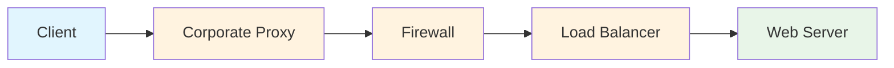
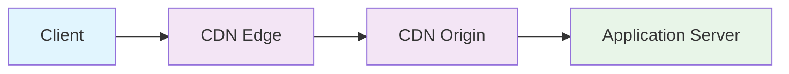

# End to End vs Hop by Hop 通信の詳細解説

## 🔄 基本概念

### **End to End（エンドツーエンド）通信**
通信の**両端点（クライアントとサーバー）間で直接関係する**処理や情報のこと。中継点（プロキシ、ルーター等）は内容を解釈・変更せずに転送する。

### **Hop by Hop（ホップバイホップ）通信**
通信経路上の**各区間（ホップ）ごとに個別に処理される**もの。各中継点で内容を解釈・変更・終端する可能性がある。

## 📊 視覚的な理解

```
End to End:
[Client] =====================================》 [Server]
         ↑               ↑               ↑
         |               |               |
    暗号化データ      中継は透過        復号化データ
    
Hop by Hop:
[Client] -----> [Proxy] -----> [LB] -----> [Server]
    ↑       ↑       ↑       ↑       ↑       ↑
    |       |       |       |       |       |
  HTTP/1.1 処理   HTTP/2  処理   HTTP/1.1  処理
         変換           変換
```

## 🌐 HTTPにおけるEnd to End vs Hop by Hop

### **End to End ヘッダー**
```http
Accept: application/json              # サーバーが解釈
Authorization: Bearer token123        # サーバーが認証に使用
Content-Type: application/json        # サーバーがデータ形式を理解
User-Agent: Mozilla/5.0...           # サーバーがクライアント識別
```

### **Hop by Hop ヘッダー**
```http
Connection: keep-alive               # 各接続区間で処理
Transfer-Encoding: chunked          # 各区間で転送方式を制御
Upgrade: websocket                  # 直接の接続相手とプロトコル交渉
Proxy-Authorization: Basic xyz      # プロキシで認証処理
```

## 🔒 セキュリティ面での違い

### **End to End セキュリティ**
```typescript
// TLS/SSL暗号化 - エンドツーエンド
const httpsRequest = https.request({
  hostname: 'api.example.com',
  port: 443,
  path: '/data',
  method: 'GET',
  // 中継点では暗号化されたデータのみ見える
});
```

**特徴:**
- クライアント⇔サーバー間で暗号化
- 中継点は暗号化されたデータを転送するのみ
- プライバシー保護が強い

### **Hop by Hop セキュリティ**
```typescript
// プロキシ認証 - ホップバイホップ
const proxyRequest = http.request({
  host: 'proxy.company.com',
  port: 8080,
  method: 'GET',
  path: 'http://api.example.com/data',
  headers: {
    'Proxy-Authorization': 'Basic ' + Buffer.from('user:pass').toString('base64')
  }
});
```

**特徴:**
- 各区間で個別に認証・暗号化
- 中継点でデータの検査・変更が可能
- 企業ネットワーク等で利用

## 🔌 WebSocketにおけるEnd to End vs Hop by Hop

### **WebSocketハンドシェイク（Hop by Hop）**
```http
GET /chat HTTP/1.1
Host: server.example.com
Upgrade: websocket                    # ← Hop by Hop
Connection: Upgrade                   # ← Hop by Hop
Sec-WebSocket-Key: dGhlIHNhbXBsZQ==  # ← End to End
Sec-WebSocket-Version: 13             # ← End to End
```

### **WebSocket通信確立後（End to End）**
```typescript
// WebSocket通信は基本的にEnd to End
const ws = new WebSocket('wss://server.example.com/chat');

ws.onopen = () => {
  // この通信は暗号化されてエンドツーエンド
  ws.send(JSON.stringify({
    type: 'message',
    content: 'Hello World'
  }));
};
```

## 🏢 実際の環境での例

### **企業環境（複数のHop）**


**各Hopでの処理:**
- **Corporate Proxy**: 認証、フィルタリング、ログ記録
- **Firewall**: セキュリティチェック、ポート制御
- **Load Balancer**: 負荷分散、ヘルスチェック

### **クラウド環境（CDN使用）**


## 📝 実装での注意点

### **プロキシ通過時のWebSocket**
以下は、プロキシ環境におけるWebSocket接続の確立を支援するクラスの例です。プロキシの存在を検出し、必要に応じて HTTP CONNECT メソッドを用いてトンネルを確立した上で WebSocket 接続を行います。これは Hop by Hop 通信の特性に基づいています。

```typescript
// プロキシ環境でのWebSocket接続
class ProxyAwareWebSocket {
  constructor(url: string, protocols?: string[]) {
    // プロキシ設定の確認
    if (this.hasProxy()) {
      // HTTP CONNECTメソッドでトンネル確立
      this.establishTunnel(url).then(() => {
        this.ws = new WebSocket(url, protocols);
      });
    } else {
      this.ws = new WebSocket(url, protocols);
    }
  }
  
  private hasProxy(): boolean {
    // プロキシ環境の検出ロジック
    return window.location.hostname.includes('.corporate.com');
  }
  
  private async establishTunnel(url: string): Promise<void> {
    // HTTP CONNECT要求でプロキシトンネル確立
    // これはHop by Hopでプロキシに処理される
  }
}
```

### **End to End暗号化の実装**
この実装は、アプリケーションレベルでの End to End 暗号化を行うためのクラス例です。TLS による通信路の暗号化に加えて、メッセージ自体も暗号化することで、通信経路上のすべての中継点において内容を秘匿化します。

```typescript
// アプリケーションレベルでのEnd to End暗号化
class SecureWebSocket {
  private encryptionKey: CryptoKey;
  
  async sendSecureMessage(data: any): Promise<void> {
    // 1. データをJSON化
    const jsonData = JSON.stringify(data);
    
    // 2. End to End暗号化（中継点では読めない）
    const encryptedData = await this.encrypt(jsonData);
    
    // 3. WebSocketで送信（TLS + アプリケーション暗号化）
    this.ws.send(encryptedData);
  }
  
  private async encrypt(data: string): Promise<ArrayBuffer> {
    const encoder = new TextEncoder();
    const dataBuffer = encoder.encode(data);
    
    return await crypto.subtle.encrypt(
      { name: 'AES-GCM', iv: crypto.getRandomValues(new Uint8Array(12)) },
      this.encryptionKey,
      dataBuffer
    );
  }
}
```

## 🎯 実際の選択基準

### **End to Endを選ぶべき場合**
- **プライバシー重視**: 金融データ、医療情報
- **セキュリティ重視**: 認証情報、個人情報
- **データ整合性**: 改ざん防止が必要
- **コンプライアンス**: 規制要件がある

### **Hop by Hopを選ぶべき場合**
- **ネットワーク最適化**: キャッシュ、圧縮
- **監査・ログ**: 企業のセキュリティポリシー
- **プロトコル変換**: HTTP/1.1 ⇔ HTTP/2変換
- **負荷分散**: 動的なルーティング

## 🔧 TypeScriptでの実装パターン

### **End to End認証**
このクラスは、End to End でのメッセージ認証を行うための例です。送信するデータにデジタル署名を付与し、受信側で改ざん検知を可能にします。中継点では署名の検証や改変は行われず、信頼性の高い通信が可能です。

```typescript
interface EndToEndMessage {
  type: string;
  timestamp: number;
  signature: string;  // サーバーが検証
  payload: any;
}

class AuthenticatedWebSocket {
  private privateKey: CryptoKey;
  
  async sendAuthenticatedMessage(data: any): Promise<void> {
    const message: EndToEndMessage = {
      type: 'authenticated',
      timestamp: Date.now(),
      signature: await this.sign(data),
      payload: data
    };
    
    this.ws.send(JSON.stringify(message));
  }
  
  private async sign(data: any): Promise<string> {
    // End to End署名（中継点では検証されない）
    const dataString = JSON.stringify(data);
    const signature = await crypto.subtle.sign(
      'RSASSA-PKCS1-v1_5',
      this.privateKey,
      new TextEncoder().encode(dataString)
    );
    return btoa(String.fromCharCode(...new Uint8Array(signature)));
  }
}
```

### **Hop by Hop接続管理**
このクラスは、Hop by Hop 通信における接続の信頼性向上のために、プロキシなどの中継点での切断を検出し、指数バックオフによる再接続を試みる仕組みを提供します。

```typescript
class HopByHopWebSocket {
  private reconnectAttempts = 0;
  private maxReconnectAttempts = 5;
  
  connect(url: string): void {
    this.ws = new WebSocket(url);
    
    this.ws.onopen = () => {
      console.log('Connected to immediate hop');
      this.reconnectAttempts = 0;
    };
    
    this.ws.onclose = (event) => {
      // Hop by Hopで切断された場合の処理
      if (event.code === 1006) { // プロキシ切断
        this.handleProxyDisconnection();
      }
    };
  }
  
  private handleProxyDisconnection(): void {
    // 各Hopでの切断に対する個別対応
    if (this.reconnectAttempts < this.maxReconnectAttempts) {
      setTimeout(() => {
        this.reconnectAttempts++;
        this.connect(this.currentUrl);
      }, Math.pow(2, this.reconnectAttempts) * 1000);
    }
  }
}
```

## 📋 まとめ

| 観点 | End to End | Hop by Hop |
|------|------------|------------|
| **処理場所** | 通信両端のみ | 各中継点 |
| **セキュリティ** | 高い（暗号化） | 中程度（中継点で解読可能） |
| **パフォーマンス** | シンプル | 最適化可能 |
| **デバッグ** | 困難 | 容易 |
| **用途** | 機密データ、認証 | 負荷分散、キャッシュ |
| **WebSocketでの例** | メッセージデータ | 接続管理、プロトコル交渉 |

**適切な選択**がアプリケーションのセキュリティとパフォーマンスを左右します。WebSocket開発では、**ハンドシェイクはHop by Hop、実際のデータ通信はEnd to End**という理解が重要です。