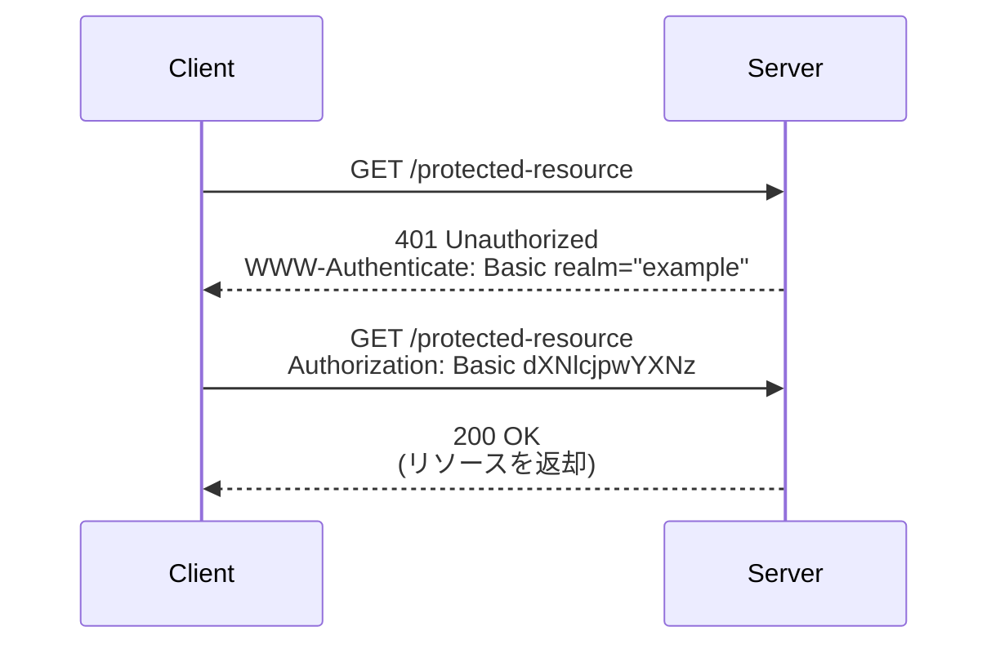
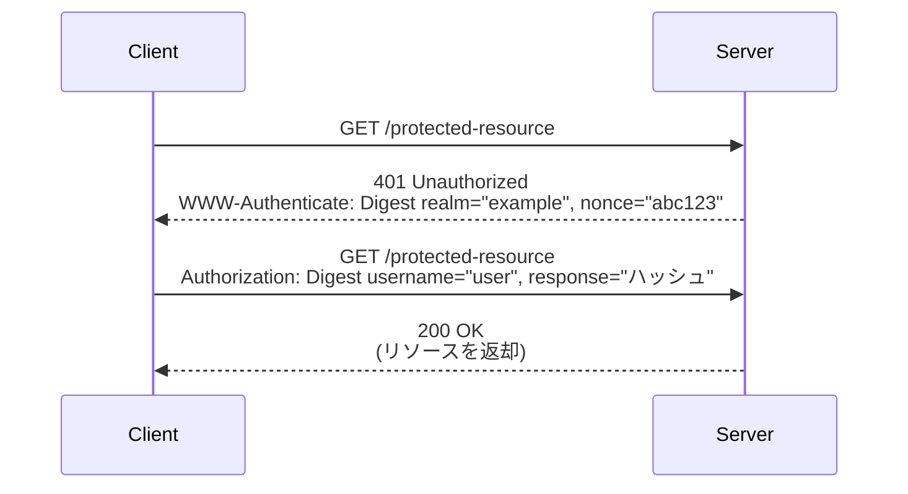
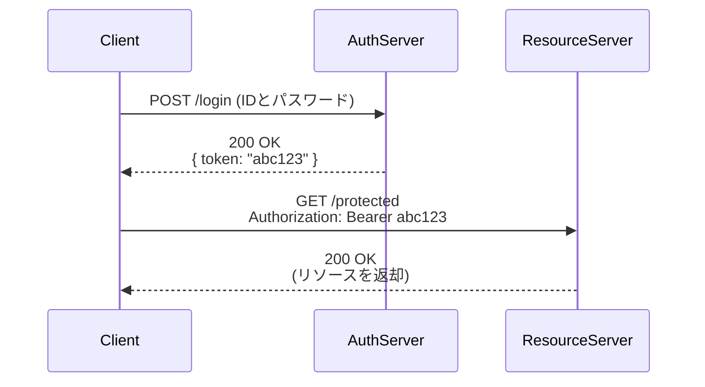
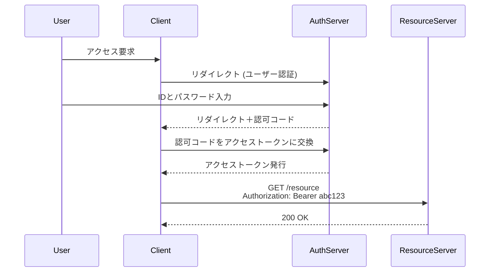
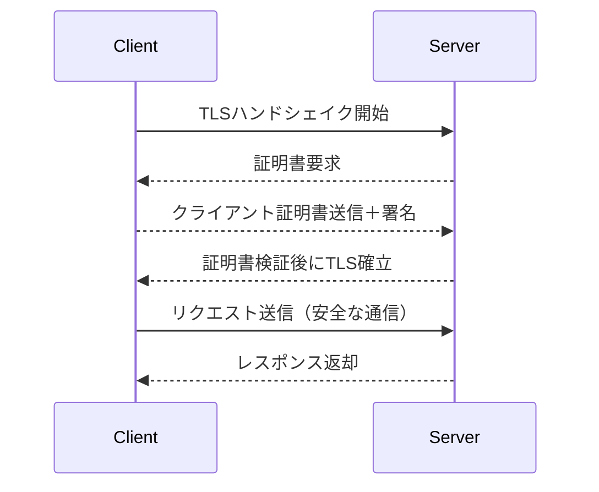
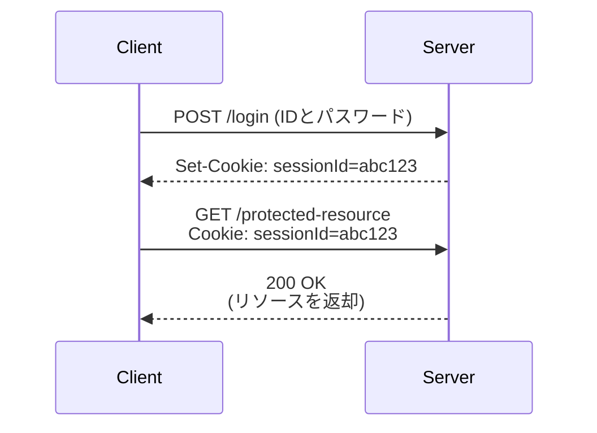

# 認証


## Basic認証

Basic認証は、HTTPの標準的な認証方式のひとつで、リクエストの `Authorization` ヘッダーにユーザー名とパスワードをBase64エンコードして送信します。最もシンプルな方式ですが、パスワードが容易に復号可能であるため、必ずHTTPSと併用する必要があります。

### Basic認証のシーケンス図

Basic認証では、保護されたリソースにアクセスする際、`Authorization` ヘッダーにBase64エンコードされたユーザー名とパスワードを付けて送信します。サーバーが認証に成功すればリソースが返却されます。



- クライアントは保護されたリソースへGETリクエストを送信します。
- サーバーは `401 Unauthorized` と `WWW-Authenticate: Basic` ヘッダーで認証を要求します。
- クライアントは `Authorization` ヘッダーにBase64エンコードした認証情報を付加して再送信します。
- サーバーが認証情報を検証し、正しければリソースを返却します。
- Basic認証では毎回同じ情報が送信されるため、HTTPSによる暗号化が必須です。

### Base64エンコード

- `Authorization: Basic dXNlcjpwYXNz` は、`user:pass` を Base64 エンコードした文字列です（この形式は容易に復号可能なため注意が必要です）。
- Basic認証は**暗号化されていないため、通信経路の盗聴を防ぐためにも必ず HTTPS と併用する必要があります**。
- 多くのAPIではセキュリティ上の理由から Basic認証ではなく BearerトークンやOAuth2が推奨されます。

#### 例
```
元の文字列: user:password
↓
Base64エンコード: dXNlcjpwYXNzd29yZA==
```

## Digest認証

Digest認証は、Basic認証と同様にHTTPヘッダーを利用した認証方式ですが、パスワードそのものではなく、ハッシュ化されたダイジェスト値を送信します。これにより、ネットワーク上でのパスワード漏洩リスクを軽減します。

- 利用時、クライアントは一度目のアクセスでサーバから `401 Unauthorized` と `WWW-Authenticate: Digest` ヘッダーを受け取ります。
- その後、ユーザー名やパスワード、ノンス（使い捨て値）、リクエストURIなどを組み合わせたハッシュ値を `Authorization` ヘッダーに付加して再リクエストを行います。

> Digest認証は一部ブラウザや環境でのサポートが限定されており、現代では使用頻度が減っています。

### Digest認証のシーケンス図

Digest認証は、パスワードを直接送信せず、サーバーが送信するノンスと共にハッシュ化したレスポンスを送ることで、盗聴リスクを軽減する仕組みです。




## トークン認証（Bearerトークン／JWT）

トークン認証は、認証後に発行されたアクセストークンを `Authorization` ヘッダーに付加して利用する方式です。

- 認証成功後にトークン（例：JWT）を取得
- クライアントは以後のリクエストで `Authorization: Bearer <token>` をヘッダーに追加
- トークンは署名されており、改ざんが困難

### トークン認証のシーケンス図

トークン認証では、初回ログインでアクセストークンを取得し、その後のリクエストではそれを `Authorization` ヘッダーに付けて認証を行います。



> サーバ側はセッション状態を保持する必要がありません（ステートレス）。


## OAuth 2.0 / OpenID Connect

OAuth 2.0は、リソースへのアクセス権を第三者に委譲するための認可フレームワークです。OpenID ConnectはOAuth 2.0の上位仕様で、ユーザーの認証も扱います。

- クライアントは認可サーバーにリダイレクトし、ユーザーがログイン
- アクセストークンやIDトークンが発行され、以後のリクエストで利用
- スコープでアクセス範囲を制御可能

### OAuth 2.0のシーケンス図

OAuth 2.0では、ユーザーが認可サーバーで認証を行い、クライアントにアクセストークンを返すことで、外部サービスによる安全なリソースアクセスが可能になります。



> GoogleやGitHubなどの外部IDプロバイダーを使ったログインに広く用いられています。


## クライアント証明書認証（mTLS）

クライアント証明書認証では、TLS接続時にクライアント証明書を提示して認証を行います。

- サーバーはTLSハンドシェイク中にクライアント証明書を要求
- クライアントは証明書と署名を提示し、サーバーが検証
- 通常のID/パスワード不要で、安全性が非常に高い

### クライアント証明書認証のシーケンス図

TLSハンドシェイク時にクライアント証明書を提示し、サーバーが検証することで安全な相互認証を実現します。



> 金融機関や機密性の高いB2B APIなどで採用されています。


## セッションベース認証（Cookie認証）

サーバーがセッションIDを発行し、それをクライアントがCookieとして保持することで認証を維持します。

- ユーザーがログインすると、サーバーがセッションIDを発行
- クライアントは以後、CookieによりセッションIDを自動送信
- サーバー側でセッション情報を管理

### セッションベース認証のシーケンス図

Webアプリで広く利用される認証方式で、サーバーがセッションIDを発行し、それをクッキーで保持します。



> CSRFなどの攻撃への対策として、トークン（例：SameSite属性、CSRFトークン）の併用が推奨されます。

