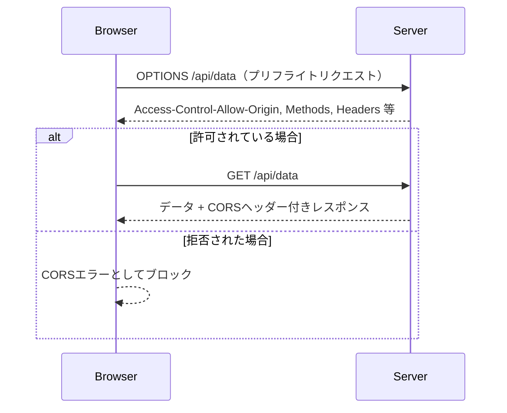

# Cross-Origin Resource Sharing（CORS）とは

CORS（クロスオリジンリソース共有）は、あるオリジン（ドメイン、ポート、プロトコルの組み合わせ）で読み込まれたWebページが、別のオリジンにあるリソースにアクセスすることを許可するための仕組みです。ブラウザのセキュリティ制約である「同一オリジンポリシー」により、JavaScriptは通常、他オリジンのリソースにアクセスできません。CORSはこれを安全に制御付きで緩和します。

## なぜCORSが必要なのか？

WebアプリケーションはAPIを通じてサーバーと通信することが一般的ですが、APIサーバーがWebアプリとは異なるオリジン上にあることもあります。たとえば以下のようなケースです：

- Webアプリ：`https://example.com`
- APIサーバー：`https://api.example.com`

この場合、ブラウザはセキュリティ上、自動ではリクエストを許可しません。サーバー側がCORSを適切に設定することで、アクセスが可能になります。

## CORSの仕組み

ブラウザがクロスオリジンのリクエストを送ると、次のようにサーバーのレスポンスに含まれるCORS用HTTPヘッダーを確認します：

- `Access-Control-Allow-Origin`: 許可されたオリジン（例：`*` や `https://example.com`）
- `Access-Control-Allow-Methods`: 許可されたHTTPメソッド（例：GET, POST, PUT）
- `Access-Control-Allow-Headers`: 許可されたカスタムヘッダー
- `Access-Control-Allow-Credentials`: 認証情報を含めたリクエストの許可（true/false）

### CORS通信の流れ（シーケンス図）

以下は、クロスオリジンのリクエスト時に、ブラウザとサーバー間でCORSがどのように機能するかを示すシーケンス図です。

この図から分かるように、CORS対応には事前のプリフライトリクエストが重要であり、サーバーが適切なレスポンスヘッダーを返すことが必要です。

## プリフライトリクエスト（Preflight）

特定の条件（カスタムヘッダーやPUT/DELETEメソッドなど）を満たす場合、ブラウザは実際のリクエストの前に「プリフライトリクエスト」として`OPTIONS`メソッドを使ってサーバーのCORS対応状況を確認します。

## セキュリティと注意点

- `Access-Control-Allow-Origin: *` は公開APIなどでは有用ですが、認証情報を含むリクエストとは併用できません。
- CORSはサーバー側の設定で制御され、クライアントからは変更できません。
- ブラウザがCORSエラーを返すとき、実際には**サーバーが適切なレスポンスヘッダーを返していない**ことが原因です。

## 参考資料

- [MDN Web Docs: CORS](https://developer.mozilla.org/en-US/docs/Web/HTTP/Guides/CORS)
