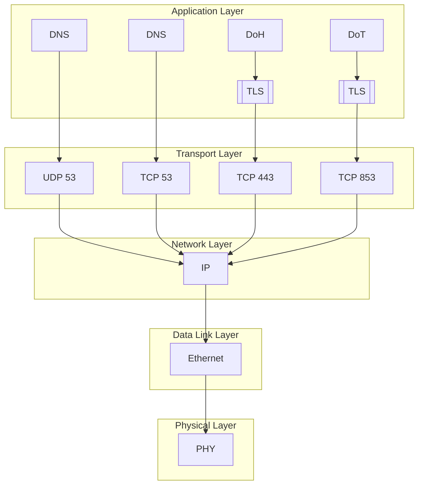
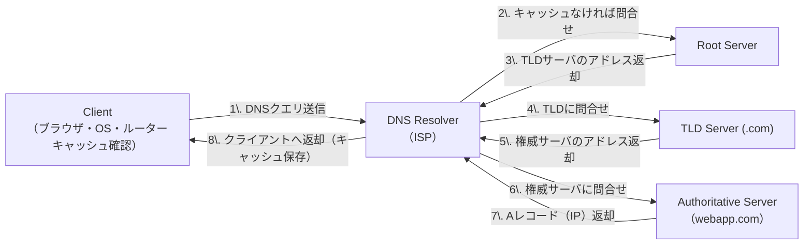
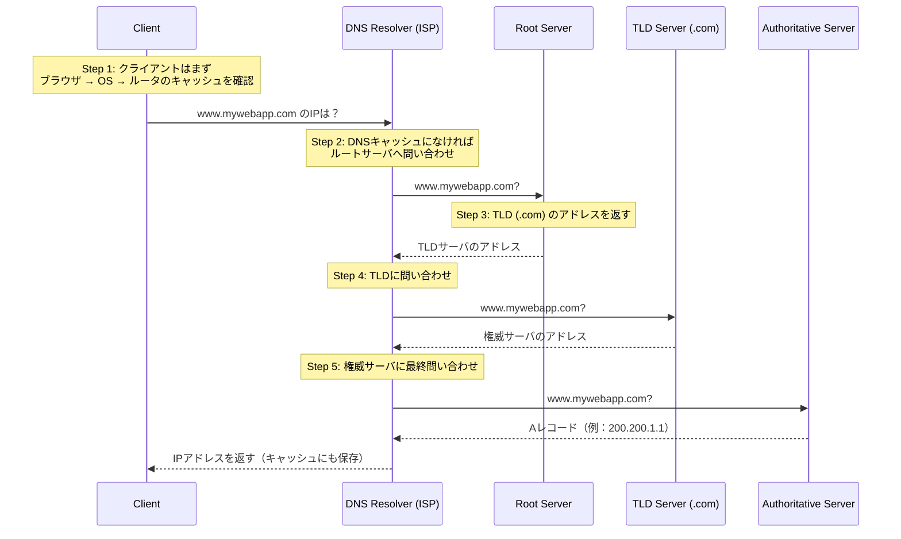
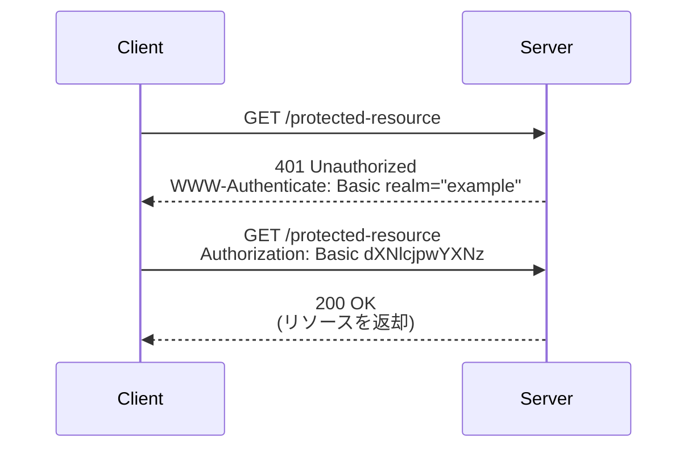

# DNS プロトコル

## DNSプロトコルスタック操作


- DNSはネームサーバーの階層構造に基づいています。
- DNSはホスト名をIPアドレスに解決します。
- 逆DNSはIPアドレスをホスト名に解決します。
- ルーティングにはIPアドレスが必要です。
- UDP 53 - 512バイト未満のほとんどのDNSクエリで高速です。
- TCP 53 - DNSゾーン転送/IPv6 AAAAレコード
- DNSはUDPペイロードを512バイトに制限します。
- 切り捨てエラーが発生した場合は、TCP 53経由で再送信します。
- DoHはDNSクエリをHTTPSリクエストにカプセル化します。
- DoTはDNSクエリをTCPにカプセル化します。


## DNSルックアッププロセス


### DNSルックアップ構成図

以下は、DNSルックアップの実際の問い合わせフローに基づいた構成図です。各構成要素がどの順序でどのようにやり取りを行うかを矢印で示しています。




### DNSルックアップシーケンス図


1. クライアントはブラウザキャッシュ、OSキャッシュ、ルーターキャッシュの順に確認し、ISPのDNSリゾルバにクエリを送信します。
2. ISPのDNSリゾルバはDNSキャッシュ参照後、ルートサーバにクエリを送信します。
3. ルートサーバは(.com)|のトップレベルドメインサーバのアドレスを返します。
4. TLDサーバはwebapp.comの権威サーバのアドレスを返します。
5. 権威サーバはwebapp.comのIPアドレスを解決し、次のサーバに送信します。

## DNS レコードタイプ

### Aレコード
ホスト名をIPv4アドレスに解決

#### 例
|hostname|record type|value|TTL|
|---|---|---|---|
|webapp.com|A|200.200.1.1|3200|

### CNAMEレコード
エイリアスまたはサブドメインをAレコードに解決

#### 例
|hostname|record type|value|TTL|
|---|---|---|---|
|blog.webapp.com|CNAME|webapp.com|3200|

### MXレコード
ルーティング用のメールサーバーのホスト名を解決

#### 例
|hostname|record type|value|TTL|
|---|---|---|---|
|webapp.com|MX|mail.server.com|3200|
### NSレコード
ルーティング用のメールサーバーのホスト名を解決

#### 例
|hostname|record type|value|TTL|
|---|---|---|---|
|webapp.com|NS|ns1.server.com|3200|

### AAAAレコード
ホスト名をIPv6アドレスに解決

#### 例
|hostname|record type|value|TTL|
|---|---|---|---|
|webapp.com|AAAA|2001:db8:3c4d: 1::1|3200|


*TTL = キャッシュをフラッシュするまでの時間間隔


## 補足事項

### DNSキャッシュとTTLの重要性

DNSは名前解決のたびに毎回問い合わせを行うとパフォーマンスが低下するため、ブラウザやOS、ルーター、ISPのDNSリゾルバなど多層にわたるキャッシュ機構を備えています。このキャッシュの保持時間はDNSレコードのTTL（Time To Live）に依存します。TTLが短すぎると頻繁な再問合せでパフォーマンスが落ち、逆に長すぎるとIP変更が即時反映されないといった影響があります。

### DoH（DNS over HTTPS）とDoT（DNS over TLS）の違い

- **DoH (DNS over HTTPS)** は、通常のHTTPS通信（TCP 443）を利用し、DNSトラフィックをHTTPリクエストにカプセル化します。Webブラウザとの親和性が高く、ファイアウォールやプロキシを回避しやすい特徴があります。
- **DoT (DNS over TLS)** は、専用ポートTCP 853でTLS暗号化通信を行うため、明示的にDNSトラフィックを保護する意図が明確です。専用アプリケーションやネットワーク機器での利用に適しています。

### 名前解決失敗時の挙動

DNSリゾルバがいずれのサーバからも応答を得られない場合、名前解決に失敗し、ブラウザでは「DNS_PROBE_FINISHED_NXDOMAIN」や「サーバーが見つかりませんでした」といったエラーが表示されます。

### セキュリティ観点での留意点

- DNSキャッシュポイズニングや中間者攻撃を防ぐため、信頼できるDNSサーバやDoH/DoTの活用が推奨されます。
- DNSSEC（DNS Security Extensions）を導入することで、DNS応答の整合性検証が可能になります（ただし対応していないサーバもあります）。

## Basic認証のシーケンス図

以下は、HTTP Basic認証における典型的な通信の流れを示すシーケンス図です。クライアントが保護されたリソースにアクセスしようとすると、サーバは `401 Unauthorized` 応答とともに認証を要求します。クライアントは `Authorization` ヘッダーにユーザー名とパスワードを Base64 でエンコードした文字列を付加して再リクエストを送り、認証に成功すればサーバは対象リソースを返します。



- `Authorization: Basic dXNlcjpwYXNz` は、`user:pass` を Base64 エンコードした文字列です（この形式は容易に復号可能なため注意が必要です）。
- Basic認証は**暗号化されていないため、通信経路の盗聴を防ぐためにも必ず HTTPS と併用する必要があります**。
- 多くのAPIではセキュリティ上の理由から Basic認証ではなく BearerトークンやOAuth2が推奨されます。

#### Base64エンコード例

```
元の文字列: user:password
↓
Base64エンコード: dXNlcjpwYXNzd29yZA==
```