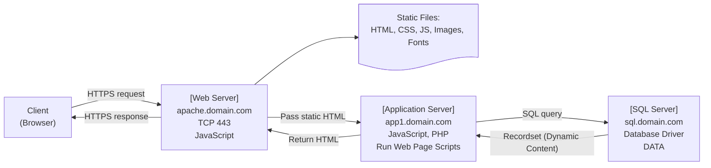

# フルスタックWebアプリケーションの構成とデータフロー

この図は、フルスタックWebアプリケーションにおける典型的なデータフローを示しています。ブラウザ（クライアント）はHTTPS経由でWebサーバーにリクエストを送り、Webサーバーは静的ファイルを返すか、アプリケーションサーバーに処理を委譲します。アプリケーションサーバーはビジネスロジックを処理し、必要に応じてデータベースサーバーにアクセスして結果を取得し、最終的にHTMLを生成してクライアントに返します。

以下は、上記の図に登場する各サーバーやコンポーネントが担う役割と、その間のやり取りについて簡潔にまとめた説明です。

- クライアント（ブラウザ）はHTTPS経由でWebサーバーにアクセスし、HTMLやCSSなどの静的ファイルを受け取ります。
- Webサーバーは静的ファイルの配信に加え、動的処理が必要な場合はリクエストをアプリケーションサーバーに転送します。
- アプリケーションサーバーは受け取ったリクエストに基づき、Webページ内のスクリプトを実行し、必要に応じてSQLサーバーにデータベースクエリを発行します。
- SQLサーバーはアプリケーションサーバーからのクエリに応じて、レコードセット（検索結果）を返します。
- アプリケーションサーバーは取得したデータを元に動的HTMLを生成し、それをWebサーバー経由でクライアントに返します。
- Webサーバーとアプリケーションサーバー、SQLサーバーが異なるドメインにある場合、CORS（クロスオリジンリソース共有）の設定が必要です。
- CORS対応としてHTTPヘッダー `Access-Control-Allow-Origin` を適切に設定することで、ドメイン間の安全な通信が可能になります。
  
CORS（クロスオリジンリソース共有）は、セキュリティの観点から重要な仕組みであり、適切に設定されていないと、クライアント側のJavaScriptが別ドメインのサーバーからデータを取得できません。

### クライアントとサーバー間のデータフォーマットの比較

Webアプリケーションでは、サーバーとクライアントの間でやり取りされるデータ形式として、JSON、XML、HTMLが使われます。それぞれの特徴は以下の通りです。

|JSON|XML|HTML|
|---|---|---|
|text-based|text-based|text-based|
|M2M|M2M|client/server|
|fast|slow|Slow|
|less secure|more secure|more secure|
|text and number|multiple data types|multiple data types|
|key values, arrays|tree structure|tree structure|
|UTF-8, ASCI|UTF-8, ASCII, ISO|UTF-8, ASCII, ISO|
|REST-API|REST-API|REST-API|