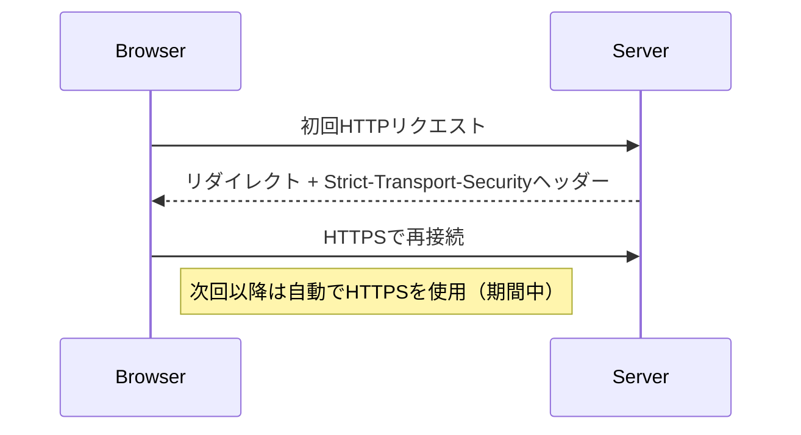

# HSTS（HTTP Strict Transport Security）

## なぜHSTSが必要か？

通常、ユーザーが `http://example.com` にアクセスした場合、サーバーがHTTPSへリダイレクト（301/302）することになりますが、この最初のHTTP接続自体が盗聴や改ざんのリスクにさらされます。

HSTSを使えば、以後のアクセスでは常にHTTPSのみを使用するようブラウザに指示でき、中間者攻撃（MITM）やプロトコルダウングレード攻撃を防止できます。

## レスポンスヘッダーの例

```http
Strict-Transport-Security: max-age=31536000; includeSubDomains; preload
```

| ディレクティブ         | 説明                                                                 |
|------------------------|----------------------------------------------------------------------|
| `max-age=秒数`         | HTTPS接続を強制する期間（秒）。例：31536000秒（1年）               |
| `includeSubDomains`    | サブドメインもすべてHTTPS接続を強制                                |
| `preload`              | ブラウザの「HSTSプリロードリスト」への登録を意図（要申請）         |

## HSTSが有効になるフロー



## HSTSプリロードとは？

GoogleやMozillaが管理する「HSTSプリロードリスト」に登録することで、最初のアクセスからHTTPSのみで通信されるようになります。これにより、初回アクセスのHTTPリスクも排除できます。

- 登録要件（例）:
  - `max-age` が1年以上
  - `includeSubDomains` 指定あり
  - `preload` 指定あり
  - サイトがHTTPSのみで正しく動作していること

## HSTS導入時の注意点

- サイト全体がHTTPSで正しく動作していることが前提です。
- 誤ってHSTSを設定すると、ユーザーは期限内にHTTP接続できなくなります（開発環境などでは慎重に）。

## 📌 HSTSの現在の必要性について

HSTSは現在でもWebセキュリティにおいて重要な役割を果たしていますが、利用の必要性は状況によって変わってきています。

### HSTSが現在も重要な理由

| 理由 | 説明 |
|------|------|
| **初回接続の安全性** | 初回アクセス時にHTTPSへリダイレクトするだけではMITM攻撃に対して脆弱。HSTSはそれを防止できます。 |
| **サブドメイン含めた強制** | `includeSubDomains` によって、サブドメインもHTTPS強制が可能（例：`mail.example.com`など） |
| **プリロード対応で初回から保護** | プリロードリストに載せれば、ブラウザが最初からHTTPSのみ接続するため非常に強固です。 |
| **プロトコル・ダウングレード攻撃の防止** | SSL Strip攻撃などを防ぐ役割を担います。 |

### HSTSが不要になる可能性があるケース

| 条件 | 説明 |
|------|------|
| CDN（例：Cloudflare）を使っていて常時HTTPS | 多くのCDNがHTTPSを強制し、HSTS相当の動作をしていることがあります。 |
| サイトがすでにプリロードされている | GoogleなどのHSTSプリロードリストに載っている場合、ブラウザは最初からHTTPSでアクセスします。 |
| サイトが完全にHTTPSにリダイレクトされていてHTTPでは露出しない | 技術的にはほぼ問題ないが、**初回接続はまだ脆弱**なままです。 |

### 結論

| サイトの種類 | HSTSの必要性 |
|---------------|----------------|
| 公開Webサイト（常時HTTPS） | **高**（特にプリロード登録が望ましい） |
| 開発環境 / 社内のみのアクセス | **中～低**（不要なこともある） |
| CDNやWAFでHTTPS強制している場合 | **中**（補完的には有効） |

> 補足: ブラウザベンダーもHSTS対応を継続しており、`preload`付きで登録されているサイトは現在でも数多く存在します。したがって、「不要」というより「役目が限定されてきている」という理解が正確です。