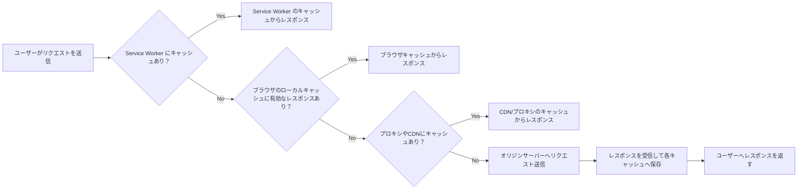
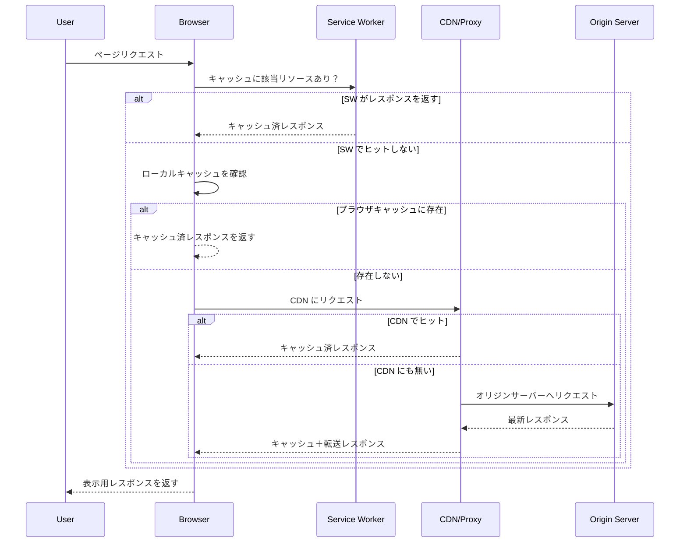

# HTTPキャッシュの仕組みとブラウザのキャッシュ制御

## HTTPレスポンスのキャッシュ順序
- Service worker
- Browser cache
- Proxy server
- CDN


1. サービスワーカーはリクエストをインターセプトし、プログラムされたキャッシュ戦略に基づいてキャッシュされたレスポンスを返します。
2. ブラウザのローカルキャッシュを確認し、有効期限が切れていない場合はブラウザにレスポンスを返します。
3. プロキシサーバーのキャッシュまたはCDNキャッシュでレスポンスを確認し、有効期限が切れていない場合はブラウザにレスポンスを返します。
4. 有効なレスポンスが存在しない場合は、オリジンサーバーに最新のレスポンスを要求するリクエストを送信します。


## HTTPキャッシュの仕組み（全体像）

以下は、HTTPリクエストが発生した際にどのような順序でキャッシュが確認され、レスポンスが取得されるのかを表したフローです。

HTTPキャッシュは、同じリソースを何度も取得しないようにすることで、ネットワーク帯域やサーバー負荷を削減し、ユーザー体験（UX）を大幅に向上させる重要な仕組みです。キャッシュは主に、レスポンスの内容とヘッダー情報（Cache-ControlやETagなど）によって制御され、どのレイヤー（Service Worker、ブラウザ、CDNなど）で保持・再利用されるかが決まります。



## HTTPキャッシュのシーケンス図（ブラウザと中間層）

以下は、ブラウザがリソースを要求する際に、Service Worker・ブラウザキャッシュ・CDN・オリジンサーバーの順にどのように問い合わせが行われるかを示したシーケンス図です。



この図は、実際のWebページ読み込み時の複数レイヤーでのキャッシュ確認とフォールバックの流れを視覚的に理解するのに役立ちます。

## HTTPキャッシュの概念

このセクションでは、キャッシュの動作を制御する主要なHTTPヘッダーや検証方法、適切なキャッシュ戦略の設計に役立つ基本知識について解説します。Webアプリケーションにおいては、リソースの更新頻度やセキュリティ要件に応じて、どのようにキャッシュさせるかを細かく設計する必要があります。

### キャッシュ方法
#### public

```
Cache-Control: public, max-age=127240
```

ブラウザはコンテンツをローカル、中間プロキシ、またはCDNにキャッシュできます。


#### private

```
Cache-Control: private, max-age=39100
```
ローカルブラウザのキャッシュのみ、レスポンスが古くなるまでの時間
レスポンスの認証ヘッダーはローカルにキャッシュできません


#### no-cache

```
Cache-Control: no-cache
```

- Last-Modified: <日付>
- E-tag: <値>

キャッシュを無効にし、オリジンサーバーからのレスポンスの取得を要求します。
コンテンツが機密性の高いデータ、または頻繁に変更されるデータ。

#### no-store

```
Cache-Control: no-store, max-age=3600
```

リバースプロキシとCDNが管理するキャッシュ（ローカルキャッシュなし）

### キャッシュ検証（レスポンスヘッダー）
- サーバーがETag（リソース変更）を送信
- サーバーがLast-Modified（日付/時刻より古い）を送信
- 古いキャッシュデータを使用するには検証が必要
- If-Modified-SinceをクライアントのLast-Modifiedヘッダーと比較

*キャッシュに保存され、変更がない場合、キャッシュの鮮度はリセットされます


## 絶対URLの例

了解しました！では、先ほどの「記号を使って範囲を明確にしたテキスト表現」を、さらにわかりやすく記号（`├─` や `└─`）を使って階層的に表現したバージョンを以下にご用意しました。

---

## 🔗 Absolute URL Examples（記号で階層を明示）

### Example 1
```
https://www.blog.courses.com/web/developer
├─ Protocol: https
├─ Subdomain: www
├─ Domain: blog
├─ TLD: courses.com
├─ Path: /web
└─ Resource: /developer
```

### Example 2
```
https://www.blog.courses.com:8080
├─ Protocol: https
├─ Subdomain: www
├─ Domain: blog
├─ TLD: courses.com
└─ Port: 8080
```

### Example 3
```
https://www.mywebapp.com/api/app.php
├─ Protocol: https
├─ Domain: mywebapp
├─ TLD: .com
└─ API Path: /api/app.php
```

### Example 4
```
http://localhost:8080
├─ Protocol: http
├─ Domain: localhost
└─ Port: 8080
```

---

この形式なら、URLの各構成要素がどこに属しているかが一目でわかりやすくなります。  
他にもこの形式で整理したいURLや、逆に「このURLの構造を分解してほしい」といったリクエストがあれば、ぜひどうぞ！