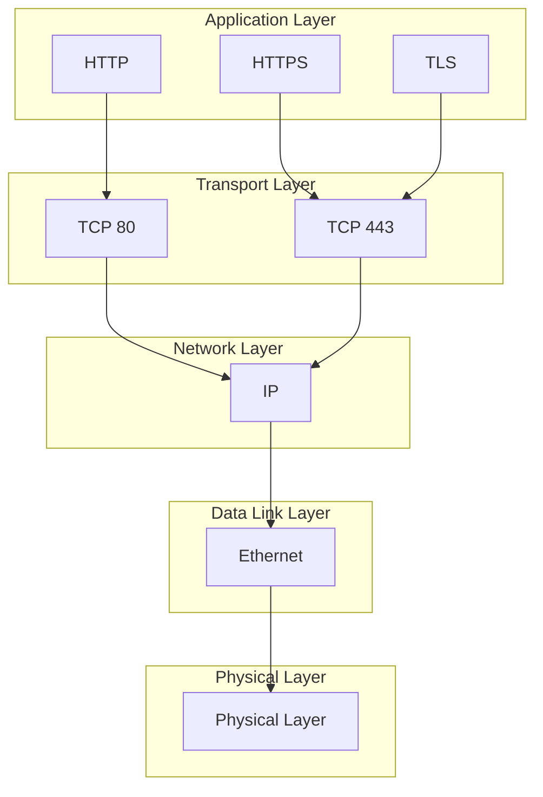
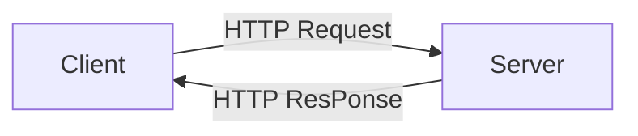

# HTTP

## HTTP プロトコルの特徴


- アプリケーション層データ転送プロトコル
- クライアント/サーバー リクエスト/レスポンス モデル
- HTTP および HTTPS（暗号化）のサポート
- GET、POST、PUT、DELETE 操作
- キャッシュ、圧縮、認証サービス
- 複数の認証方法（OAuth2、JWT など）


## HTTPリクエスト/レスポンスモデル




## HTTPリクエスト

### HTTPリクエストの構成要素

HTTPリクエストは主に以下の3つの構成要素から成り立っています。

#### 1. リクエストライン (Request Line)
- 構文：`<メソッド> <パス> <HTTPバージョン>`
- 例：`GET /index.html HTTP/1.1`
- 内容：
  - **メソッド**: GET, POST など
  - **パス**: リクエスト対象のリソースパス
  - **HTTPバージョン**: 通常は HTTP/1.1 または HTTP/2

#### 2. ヘッダー (Headers)
- 構文：`Header-Name: Header-Value`
- 目的：クライアントやリクエストに関する情報を伝える
- 例：
  ```
  Host: example.com
  User-Agent: Mozilla/5.0
  Content-Type: application/json
  Authorization: Bearer <token>
  ```

#### 3. ボディ (Body)
- リクエストの実データ（主にPOSTやPUT）
- 通常はJSONやフォームデータなど
- 例：
  ```json
  {
    "name": "John",
    "email": "john@example.com"
  }
  ```

下表では、代表的なメソッドにおける構成要素の使われ方を整理しています。

| メソッド | 用途 | キャッシュ可否 | 冪等性 | リクエストボディ | レスポンスボディ | 備考 |
|---|---|---|---|---|---|---|
| GET | データ取得 | ○ | ○ | × | ○ | 読み取り専用、ブックマーク可、URL長制限あり（2048文字） |
| POST | リソース作成・更新 | × | × | ○ | ○ | 任意のデータ型・長さ、状態変化を伴う |
| PUT | リソース作成・置換 | × | ○ | ○ | △ | 完全置換、既存なら更新 |
| DELETE | リソース削除 | × | ○ | △ | △ | 実装によりボディ有無が異なる |

### HTTPリクエストの例（生データ形式）

以下は、主なHTTPメソッドにおけるリクエストの生データ例です。

#### GET
```
GET /api/items HTTP/1.1
Host: example.com
User-Agent: Mozilla/5.0
Accept: application/json
```

#### POST
```
POST /api/items HTTP/1.1
Host: example.com
Content-Type: application/json
Content-Length: 48

{
  "name": "Sample Item",
  "price": 1000
}
```

#### PUT
```
PUT /api/items/123 HTTP/1.1
Host: example.com
Content-Type: application/json
Content-Length: 60

{
  "name": "Updated Item",
  "price": 1200,
  "available": true
}
```

#### DELETE
```
DELETE /api/items/123 HTTP/1.1
Host: example.com
```

---

### 補助的なHTTPメソッドの活用

以下のメソッドは、主にAPI設計やHTTP通信制御において補助的に使用されます。

| メソッド | 用途 | 主な使用シーン |
|---|---|---|
| HEAD | 本体レスポンス不要なメタデータ確認 | ファイルサイズ・更新日時チェックなど |
| PATCH | リソースの部分更新 | JSONの特定フィールドだけを更新したい場合 |
| OPTIONS | サーバーが許可する通信内容の確認 | CORS対応時のプリフライトリクエスト |
| CONNECT | プロキシ経由でのSSLトンネル確立 | HTTPS接続のプロキシ通過時（Webブラウザなど） |
| TRACE | 通信経路のデバッグ | デバッグ用途に限定（通常無効化される） |

> 通常のWebアプリケーション開発では、GET/POST/PUT/DELETE を中心に使用しますが、より高度なAPI制御やセキュリティ対応では、上記の補助的メソッドも役立ちます。設計段階で使用目的を明確にすることが重要です。

### HTTPレスポンス

### HTTPレスポンスの構成要素

HTTPレスポンスは、クライアントからのリクエストに対してサーバーが返す応答であり、主に次の3つの構成要素からなります。

#### 1. ステータスライン (Status Line)
- 構文：`<HTTPバージョン> <ステータスコード> <理由句>`
- 例：`HTTP/1.1 200 OK`
- 内容：
  - **HTTPバージョン**: 応答に使われるバージョン（例: HTTP/1.1）
  - **ステータスコード**: 応答の結果（例: 200, 404）
  - **理由句（Reason Phrase）**: 人間可読な説明（例: OK, Not Found）

#### 2. ヘッダー (Headers)
- クライアントに対して追加情報を伝えるメタデータ
- 例：
  ```
  Content-Type: application/json
  Content-Length: 123
  Set-Cookie: sessionId=abc123
  Cache-Control: no-cache
  ```

#### 3. ボディ (Body)
- 応答の実データ（HTML、JSON、画像など）
- 例：
  ```json
  {
    "id": 1,
    "message": "Hello, world!"
  }
  ```

ボディの有無や形式はステータスコードやヘッダーによって異なります。

### HTTPレスポンスの例（生データ形式）

#### 200 OK（GET/POST成功時）
```
HTTP/1.1 200 OK
Content-Type: application/json
Content-Length: 123

{
  ...
}
```

#### 201 Created（POST成功でリソース作成）
```
HTTP/1.1 201 Created
Location: /api/items/124
Content-Type: application/json

{
  ...
}
```

#### 204 No Content（PUTやDELETE成功でレスポンスなし）
```
HTTP/1.1 204 No Content
```

#### 400 Bad Request（不正なリクエスト）
```
HTTP/1.1 400 Bad Request
Content-Type: application/json

{
  "error": "Invalid input data"
}
```

### HTTPレスポンスコード
- 1xx : 情報 (100 継続)
- 2xx : 成功 (200 OK)
- 3xx : リダイレクト (304 変更なし)
- 4xx : クライアントエラー (401 不正アクセス)
- 5xx : サーバーエラー (503 サービス利用不可)
