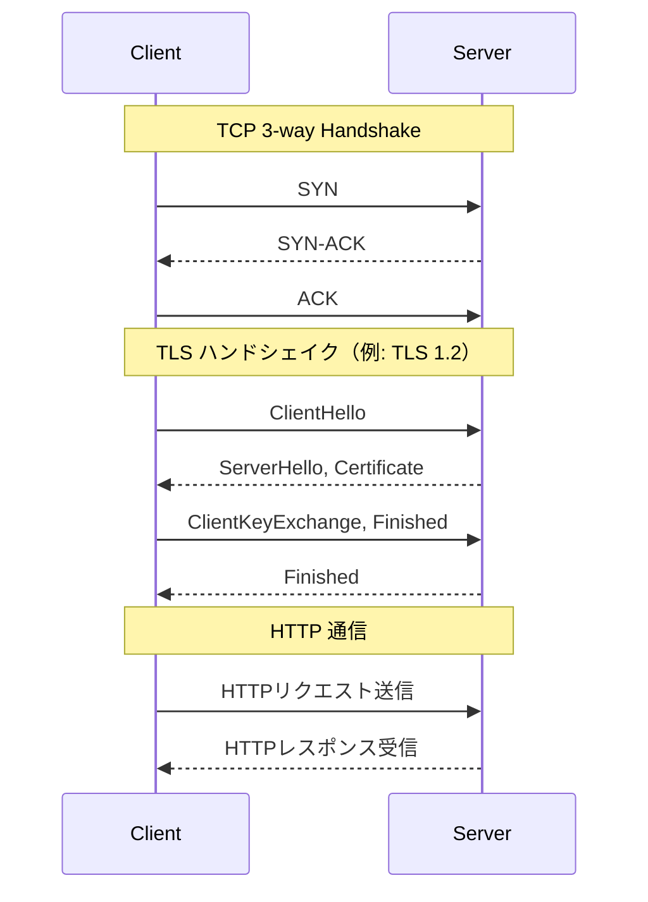
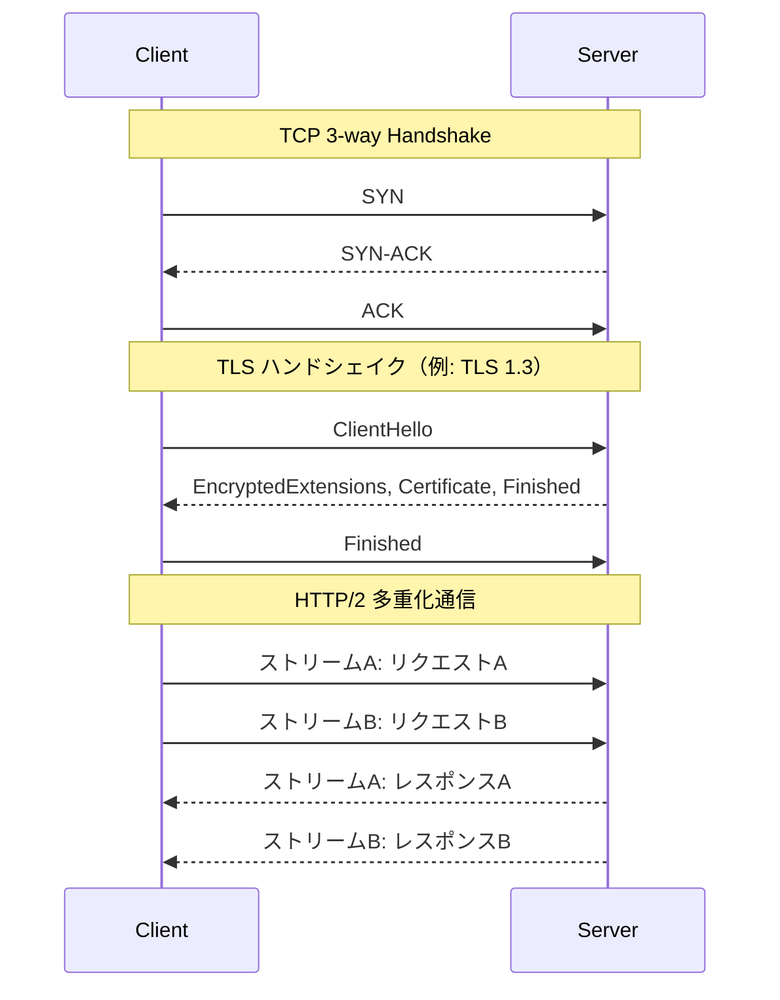
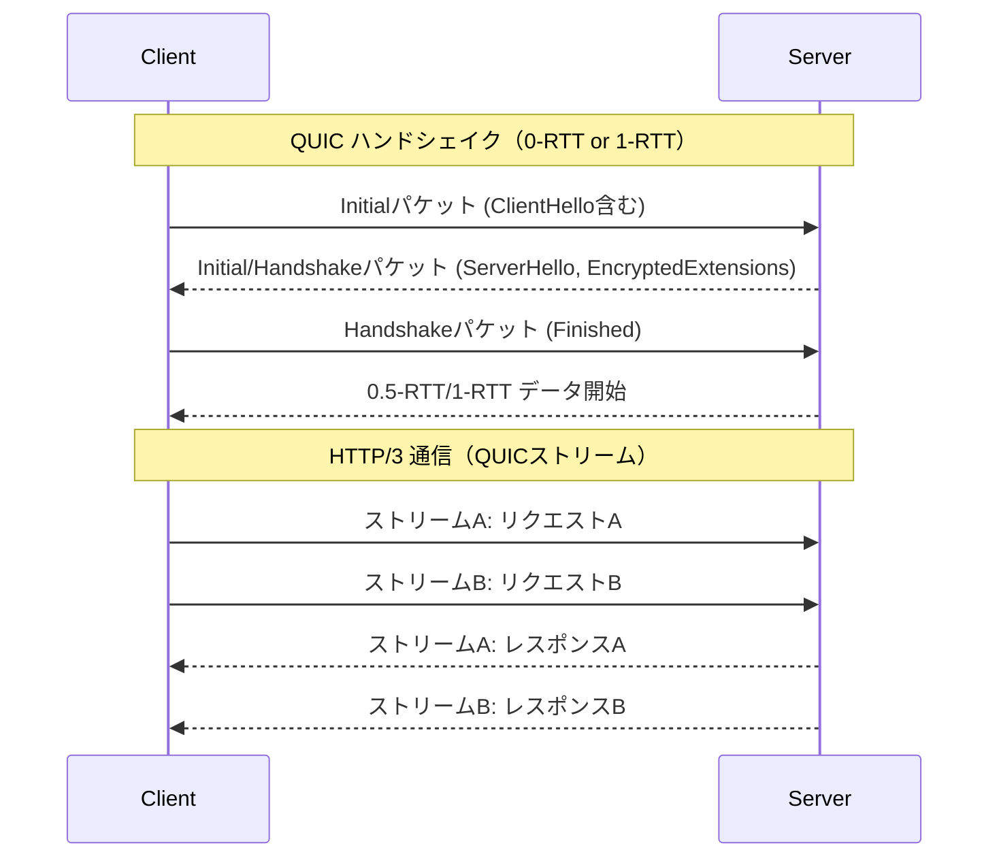
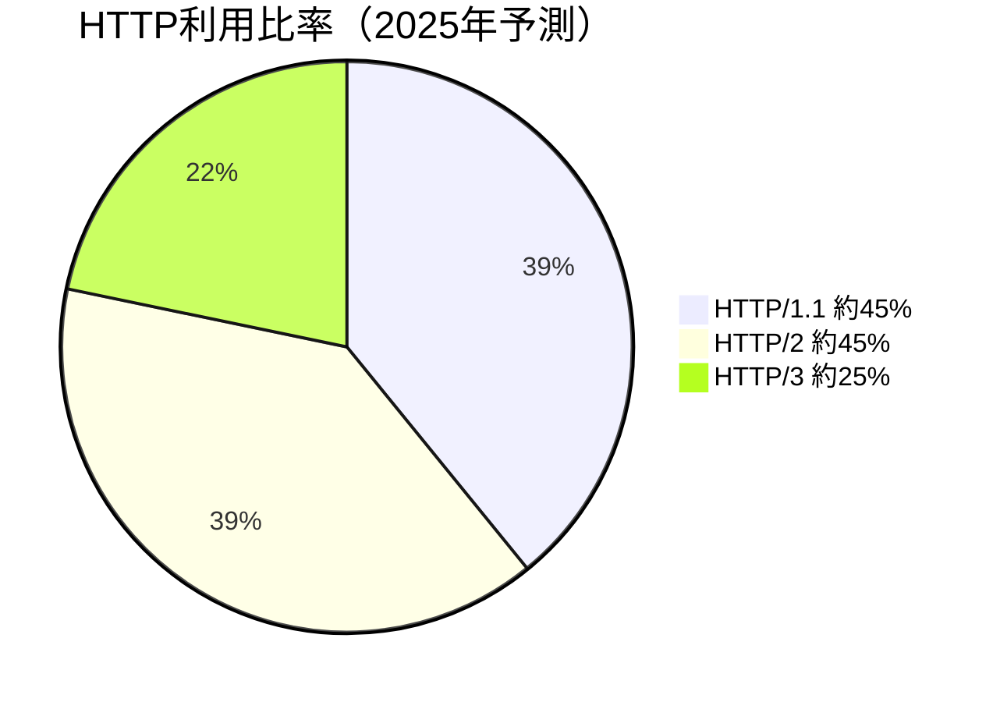
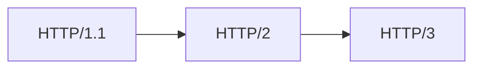

# HTTP/1.1・HTTP/2・HTTP/3 の比較

以下の表は、HTTP/1.1、HTTP/2、HTTP/3 の主な違いを示したものです。  
（参考: [インフラエンジニアの基礎知識 - HTTP/3](https://www.infraexpert.com/study/tcpip16.8.html)）

| 特徴 | HTTP/1.1 | HTTP/2 | HTTP/3 |
|---|---|---|---|
| トランスポート層 | TCP | TCP（＋TLS） | QUIC（UDPベース） |
| ヘッダー圧縮 | 無し | HPACK（バイナリ圧縮） | QPACK（HPACKのQUIC対応版） |
| 多重化 | 不可（リクエストごとに接続） | 可（1接続で多重リクエスト） | 可（1接続で多重リクエスト） |
| HOLブロッキング | 発生 | 回避（アプリ層のみ） | 回避（トランスポート層も） |
| サーバープッシュ | 無し | あり | あり |
| 通信の信頼性 | TCPによる信頼性 | TCPによる信頼性 | QUICにより信頼性確保（再送制御等） |
| 接続確立の高速性 | 3ウェイハンドシェイク＋TLS | TLS 1.2 or 1.3（1-RTT or 2-RTT） | 0-RTT or 1-RTT（QUICは接続高速） |
| 移行性（モバイル等） | 低い（TCP切断） | 低い（TCP切断） | 高い（接続情報を保持して再接続可能） |

※ HoL（Head of Line）ブロッキングとは、TCPベースのネットワークにおいて、あるパケット（またはストリーム）の再送が原因で、その後に続くパケット（またはストリーム）の送受信がブロックされてしまう現象です。

## 各HTTPバージョンのポート・TLS・識別方式比較

| HTTPバージョン | TLS使用 | 標準ポート | プロトコル識別方式 | 備考 |
|---|---|---|---|---|
| HTTP/1.1 | 任意 | 80 (HTTP), 443 (HTTPS) | `Upgrade` ヘッダーやポートによる暗黙識別 | HTTP/1.1 over TLS は HTTPS として広く使用 |
| HTTP/2 (h2) | 必須（実質）| 443 | ALPN (TLS拡張) | ブラウザは h2c 非対応、h2 は TLS が前提 |
| HTTP/2 (h2c) | 無し | 80 | `Upgrade: h2c` ヘッダー | ブラウザ非対応。gRPCやサーバ間通信で一部使用 |
| HTTP/3 | 必須 | 443 | ALPN + QUIC バージョン拡張 | QUIC上で動作。TLS 1.3 相当を内包し高速化対応 |

## 各HTTPバージョンの接続シーケンス図（詳細版）

### HTTP/1.1（TLSあり）

### HTTP/2（TLSあり）

### HTTP/3（QUIC over UDP）

## HTTP/3 は HTTP/1.1 や HTTP/2 を置き換えるのか？

現時点では、HTTP/1.1 や HTTP/2 がすぐに HTTP/3 に完全に置き換わることはありません。ただし、以下の点を考慮すると、今後数年〜10年単位で徐々に HTTP/3 への移行は進むと見られます。

### 現状の普及状況（2023年時点）

| プロトコル | 普及率（概算） | 備考 |
|---|---|---|
| HTTP/1.1 | 約90%以上（fallback 含む） | 最も高い互換性がある。現在も多くの環境で有効 |
| HTTP/2 | 約70〜75% | HTTPS接続のデフォルト。広く普及 |
| HTTP/3 | 約25〜30% | QUICベースで急成長中だが、サーバ・環境依存 |

### 参考：2025年時点の全体利用比率（プロトコル別構成）

※ 各プロトコル利用全体を100%とした場合の構成比率の推定値（2025年6月現在の観測ベース）

| プロトコル | 利用比率（全体100%中） | 備考 |
|---|---|---|
| HTTP/1.1 | 約40〜50% | fallback含めて根強く利用 |
| HTTP/2 | 約45〜50% | HTTPSベース通信では今も主流 |
| HTTP/3 | 約20〜25% | CDN・大手プラットフォーム中心に増加中 |

> 出典例: W3Techs, Cloudflare Radar, Akamai State of the Internet などの2025年上半期統計に基づく推計。

### 今後の見通し

- **HTTP/3** は QUIC ベースであり、高速性やモバイル移動性に優れている。
- 一方で **UDPポートの制限** や **ネットワーク機器・プロキシの非対応** により導入障壁がある。
- **HTTP/2 は今後数年メインで使われ続ける** が、CDN・大手Webサービスから徐々に HTTP/3 への移行が進む。

### 結論

- **HTTP/1.1 → HTTP/2 → HTTP/3** の段階的移行が進行中。
- ただし、HTTP/1.1 は fallback として長期的に残る見込み。
- ブラウザやサーバは **ALPN によって動的に最適なプロトコルを選択** する仕組みがあるため、ユーザーは意識せず利用できる。

HTTP/4 の計画は現時点では存在せず、当面は HTTP/3 の普及と改善が中心となります。

## なぜ HTTP/1.1 は残るのか？

HTTP/1.1 は現在でも広く利用され続けていますが、その主な理由はインフラ側ではなく **ソフトウェアおよび運用環境の都合** にあります。

### 主な要因

| 分類 | 要因 |
|---|---|
| ソフトウェア | アプリやフレームワークが HTTP/1.1 前提で設計されている |
| TLSの有無 | HTTP/2（h2）は TLS 前提。HTTPS 化されていない環境では HTTP/1.1 が継続使用 |
| 開発習慣 | 開発環境・社内ツールでは HTTP/1.1 の方が設定不要で手軽 |
| 中間装置 | 一部のロードバランサやプロキシが HTTP/1.1 をデフォルトで使用 |
| 互換性 | 全ブラウザ・ツール・ネットワークが HTTP/1.1 に確実対応 |

### 結論

HTTP/1.1 は「どこでも動く」プロトコルとして、**互換性重視の場面で今後もしばらく残る**と考えられます。

## HTTPバージョン移行の現実的なルート

HTTP/1.1 から HTTP/3 への直接移行は、技術的・運用的に現実的ではありません。一般的な移行ルートは次のようになります。

### 移行フロー図

### なぜ段階的移行になるのか？

- **HTTP/2 は TCPベースのため、HTTP/1.1 との互換性が高い**
- **HTTP/3 は UDP＋QUIC ベース**で通信モデルが根本的に異なり、導入コストも大きい
- アプリ・中間装置・TLS・ポート制限など、考慮すべき要素が多いため

### 結論

1. まず HTTP/2 を導入（TLS環境で容易）
2. 必要に応じて HTTP/3 を段階的に適用（特にモバイル・CDN用途）
3. HTTP/1.1 は fallback として長期残存