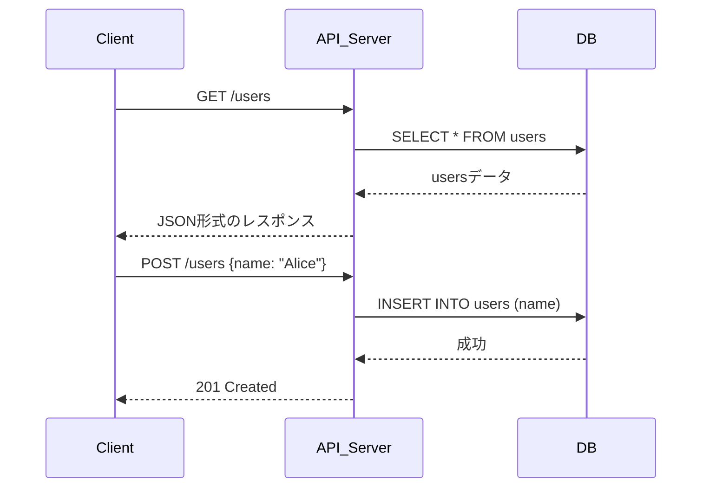

# REST API Application

## REST API とは？

REST（Representational State Transfer）は、Webアーキテクチャの設計原則に基づいたAPIのスタイルです。REST APIは、HTTPをプロトコルとして利用し、クライアントとサーバ間でリソース（データ）の状態を表現し、操作するためのインタフェースを提供します。

## 特徴

- **ステートレス**：各リクエストは独立しており、サーバはクライアントの状態を保持しません。
- **一貫したインタフェース**：HTTPメソッド（GET, POST, PUT, DELETE など）を用いて標準的な操作を行います。
- **リソース指向**：エンドポイントは `/users/123` や `/articles/456/comments` のように、リソース（名詞）に対応します。
- **HTTP標準の活用**：ステータスコード、ヘッダー、キャッシュ制御など、HTTPの標準機能を活用します。

## 主なHTTPメソッドの役割

| メソッド | 説明                   | 安全性 | 冪等性 |
|----------|------------------------|--------|--------|
| GET      | リソースの取得         | ○      | ○      |
| POST     | 新規リソースの作成     | ×      | ×      |
| PUT      | リソースの更新（全体） | ×      | ○      |
| PATCH    | リソースの部分更新     | ×      | ×      |
| DELETE   | リソースの削除         | ×      | ○      |

## REST API アプリケーションフロー

以下は、典型的なREST APIを用いたWebアプリケーションの処理フローの一例です。

## 実装と設計上のポイント

- URIは動詞でなく名詞を使う（例: `/getUser` ではなく `/users`）
- ステータスコードを正しく使う（例: 200, 201, 204, 400, 404, 500）
- JSONをデフォルトのデータフォーマットとするのが一般的
- バージョン管理を意識する（例: `/api/v1/users`）

