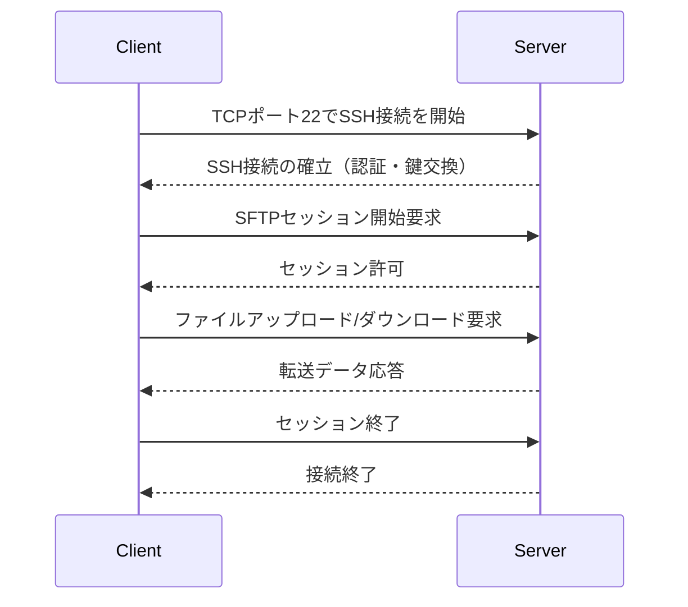

# SFTP（SSH File Transfer Protocol）

## SFTPとは？

SFTP（SSH File Transfer Protocol）は、SSH（Secure Shell）上で動作するセキュアなファイル転送プロトコルです。名前に「FTP」と含まれていますが、従来のFTPとは全く異なるプロトコルであり、ファイルの送受信を暗号化されたセッション内で安全に行うことができます。

## 主な特徴

- SSHを利用するため、暗号化・認証が強力
- ファイル転送、削除、リネームなどのファイル管理操作に対応
- FTPとは異なり、1つの接続で全ての操作を行う（コントロール/データチャンネルの分離なし）

## シーケンス図

## SFTPとFTPS、HTTPとの比較表

| 項目 | SFTP | FTPS | HTTP |
|------|------|------|------|
| 暗号化方式 | SSH（AES, ChaCha20など） | TLS（RSA, AESなど） | 基本は平文（HTTPSでTLS利用可） |
| 認証方式 | パスワード / 公開鍵認証 | パスワード / 証明書 | ベーシック認証 / セッションクッキー等 |
| 通信ポート | 22 | 990（Explicitは21） | 80（HTTPSは443） |
| ファイル管理 | ✅（一覧、削除、変更など） | ✅ | ❌（原則GET/POSTなどのリソース操作） |
| セッション制御 | 単一チャネル | 複数チャネル（制御+データ） | ステートレス（リクエスト単位） |
| 通信の信頼性 | 高（SSH上での堅牢な接続） | 中（TLSの取り扱いに注意） | 低～中（HTTPS推奨） |
| バイナリ対応 | ✅ | ✅ | △（GET/POSTで可能だが最適化されていない） |

## 補足

- SFTPはファイアウォールに対して扱いやすい（単一ポート）ため、セキュリティ運用の面でもFTPSより管理しやすいことが多いです。
- SFTPはUNIX系システムで広くサポートされており、自動化スクリプトやcronとの相性も良いです。

> 注意：SFTPとFTPSは混同されやすいですが、内部動作やセキュリティ設計が全く異なるプロトコルです。