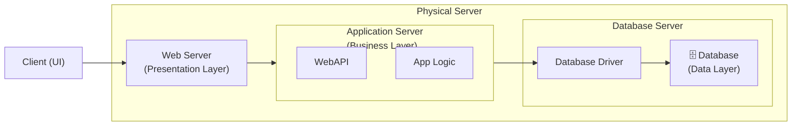
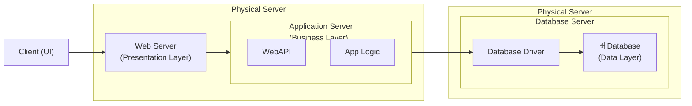
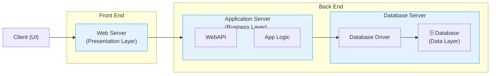

# 単層と多層展開
本章では、単層から多層にわたるアプリケーション展開モデルについて、各構成の概要とその利点・欠点を比較しながら説明します。特にWebアプリケーションのアーキテクチャを理解するために、各構成がどのような場面に適しているかを判断する手助けとなります。

## 単一サーバーアプリケーション展開モデル
単一サーバー構成は、すべてのアプリケーションレイヤー（プレゼンテーション、ビジネス、データ）が1台の物理サーバー上で動作するもっとも単純な構成です。社内システムや試験導入に適しており、導入コストも最小限です。ただし、負荷増加や障害時のリスクが高いため、大規模利用には不向きです。

### 利点と欠点

|✅ 利点|❌ 欠点|
|---|---|
|<ul><li>イントラネットアプリケーションのみ</li><li>導入コストが低い</li><li>ネットワーク遅延は無視できる （バックエンドなし）</li><li>プロトコルのチャティネス／スケーリングが最小限</li></ul>|<ul><li>サーバー処理の遅延が大きい</li><li>単一セキュリティゾーンの脆弱性</li><li>単一障害点設計</li><li>データベースサーバーのスケーラビリティの問題</li><li>接続数のしきい値を超えるとスケーリングや構成変更が必要になる</li></ul>|

## 2層アプリケーション展開モデル

2層構成では、アプリケーションサーバーとデータベースサーバーを物理的に分離します。これにより、セキュリティレベルの分離やデータベース側のスケーラビリティ確保が可能になります。中規模な社内外アプリケーションにおいてバランスの取れた構成です。

### 利点と欠点

|✅ 利点|❌ 欠点|
|---|---|
|<ul><li>イントラネット／インターネット アプリケーション</li><li>中程度の導入コスト</li><li>マルチゾーンサーバセキュリティ</li><li>中程度のサーバ処理遅延</li><li>中程度の信頼性</li><li>スケーラブルなデータベースサービス（水平方向）</li></ul>|<ul><li>バックエンドネットワークのレイテンシ （データセンター）</li><li>インターネットネットワークのレイテンシ</li><li>プロトコルの通信頻度（チャット性）</li><li>接続数のしきい値に応じてスケーリングが必要になるモデル</li></ul>|

## 3層アプリケーション展開モデル

3層構成は、フロントエンド（プレゼンテーション層）、アプリケーションサーバー（ビジネスロジック層）、データベースサーバー（データ層）をそれぞれ独立させた構成です。高い可用性・セキュリティ・スケーラビリティが求められる商用システムに最適ですが、その分、導入や運用にかかるコストも高くなります。

|✅ 利点|❌ 欠点|
|---|---|
|<ul><li>イントラネット／インターネットアプリケーション</li><li>導入コストが最も高い</li><li>マルチゾーンサーバセキュリティ</li><li>分散サーバ処理遅延</li><li>最高レベルの信頼性</li><li>スケーラブルなデータベースサービス （水平スケーリング）</li></ul>|<ul><li>バックエンドネットワークのレイテンシ （データセンター）</li><li>インターネットネットワークのレイテンシ</li><li>上位プロトコルの通信頻度</li><li>接続しきい値により水平スケーリングが開始</li></ul>|