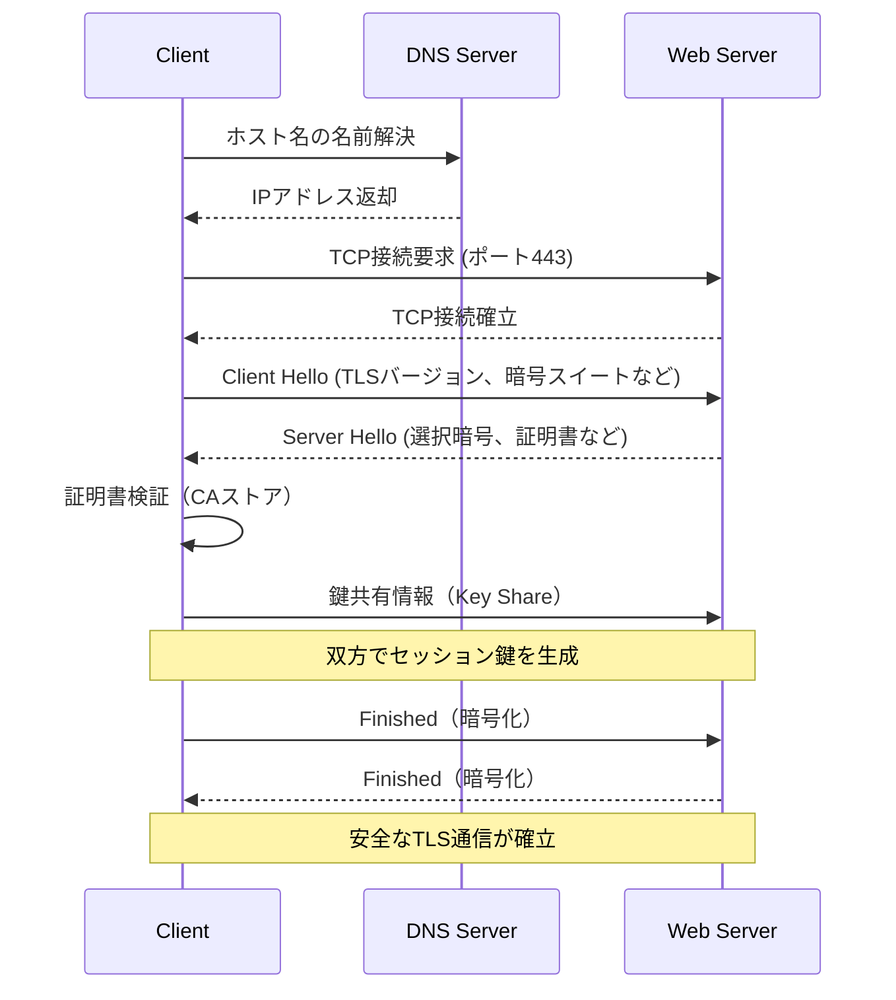
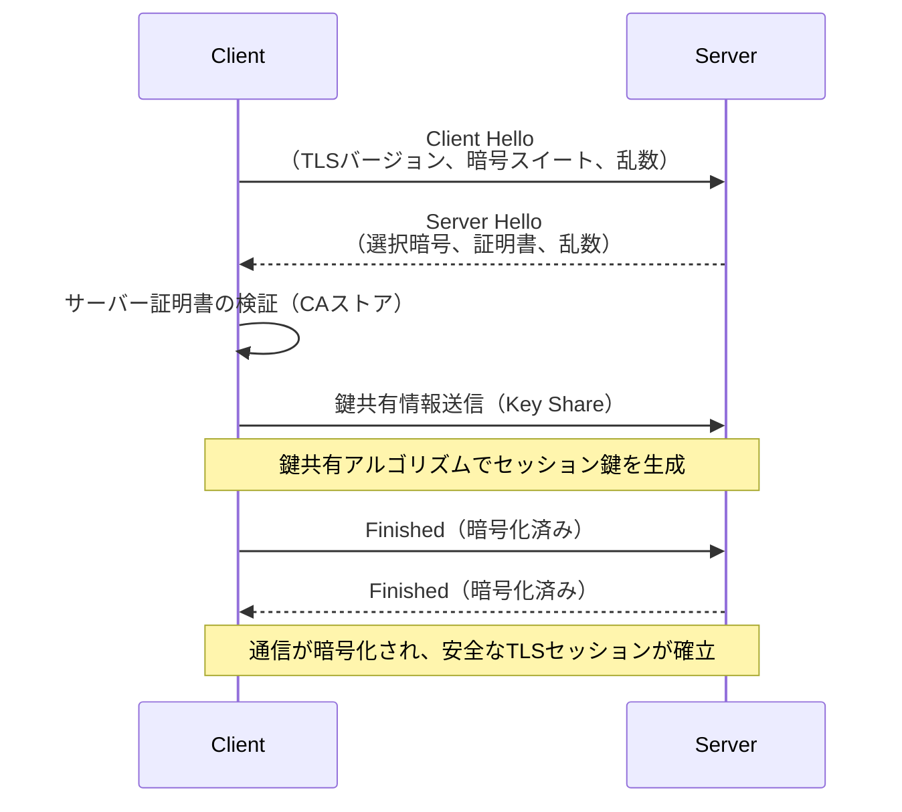

# TLS（Transport Layer Security）
TLS（Transport Layer Security）は、インターネット通信のセキュリティを確保するためのプロトコルです。SSLの進化版であり、暗号化、認証、完全性の保護を提供します。主にWebサイトのHTTPS通信で使用され、個人情報や機密情報などの安全なやり取りに不可欠です

## TLSの特徴

- 全ウェブサイトの80%にTLSが実装されています
- クライアント/サーバー型アプリケーション層のサブプロトコル
- ヘッダー/ペイロードの転送中暗号化
- サーバーはCA（認証局）によって署名されたTLS証明書を提示することで、クライアントに正当なサーバーであることを証明できます
- ペイロードデータの整合性チェック（ハッシュ化）
- HTTPS用サーバー側TCP 443ソケットリスナー
- TLS 1.3は最速のハンドシェイクと最強の暗号方式を備えています

## TLSの主な機能

TLSは、Web通信において以下の3つの主要なセキュリティ機能を提供します：

- **暗号化（Confidentiality）**：通信内容を第三者が傍受できないように暗号化します。
- **認証（Authentication）**：サーバーが正当な存在であることを証明し、場合によってはクライアントも認証されます。
- **完全性の保護（Integrity）**：通信内容が改ざんされていないことを保証します。

これらの機能により、TLSは信頼性の高い安全なWeb通信を実現します。

## TLSセッション接続の流れ

以下は、クライアントがWebサーバーとTLSセッションを確立するまでの一連のプロセスです。

この流れに含まれる主な要素は次の通りです：

- クライアントはDNSで取得したIPアドレスを使ってWebサーバーに接続し、TLSハンドシェイクを開始します。
- WebサーバーはTCPポート443でインバウンドHTTPS接続をリスナーします。
- Webサーバーは、固有の公開鍵（署名）を含むCA証明書をクライアントに送信します。
- クライアントは、ローカルのトラストストアで証明書の有効性を検証し、サーバーを認証します。
- クライアントとサーバーは、共通の鍵共有アルゴリズム（例えばECDHE）を用いて、セッション鍵（対称鍵）を安全に共有します。
- 一般的な公開CAが発行するTLS証明書の有効期間は最大397日で、期限切れ前に更新が必要です。
- 有効期間を過ぎた証明書は無効とされ、ブラウザによって接続が拒否されます。

> 補足: TLS 1.3では従来のRSAベースの鍵交換方式が廃止され、前方秘匿性（PFS）を持つ鍵交換（ECDHEなど）のみが利用されます。これにより、過去の通信内容が将来漏洩するリスクを低減します。

## TLSとSSLの違い

TLS（Transport Layer Security）は、SSL（Secure Sockets Layer）の後継プロトコルです。SSL 3.0の後継としてTLS 1.0が策定され、その後TLS 1.3まで進化しています。

主な違いは以下の通りです：

- TLSはより強力な暗号化アルゴリズムとセキュリティ機構を採用しています。
- SSLは既に非推奨（deprecated）となっており、現代のシステムではTLSの使用が推奨されています。
- TLS 1.3では、従来のRSA鍵交換や一部の暗号スイートが廃止され、より高速で安全な通信が実現されています。

したがって、「SSL通信」と表現される場合でも、実際にはTLSが使用されているケースがほとんどです。

## TLSハンドシェイクイベント

1. クライアントは、対応可能なTLSバージョンや暗号スイート情報を含む「Client Hello」をサーバーに送信します。
2. サーバーは、自身の証明書と暗号方式を含む「Server Hello」をクライアントに送信します。
3. クライアントは、サーバー証明書をローカルの信頼済みCAストアと照合して正当性を検証します。
4. クライアントとサーバーは、鍵共有アルゴリズム（例：ECDHE）により共通のセッション鍵を生成します。
5. クライアントは、セッション鍵を使ってFinishedメッセージを暗号化し送信します。
6. サーバーもセッション鍵で暗号化したFinishedメッセージをクライアントに返し、セキュアな通信が確立されます。
