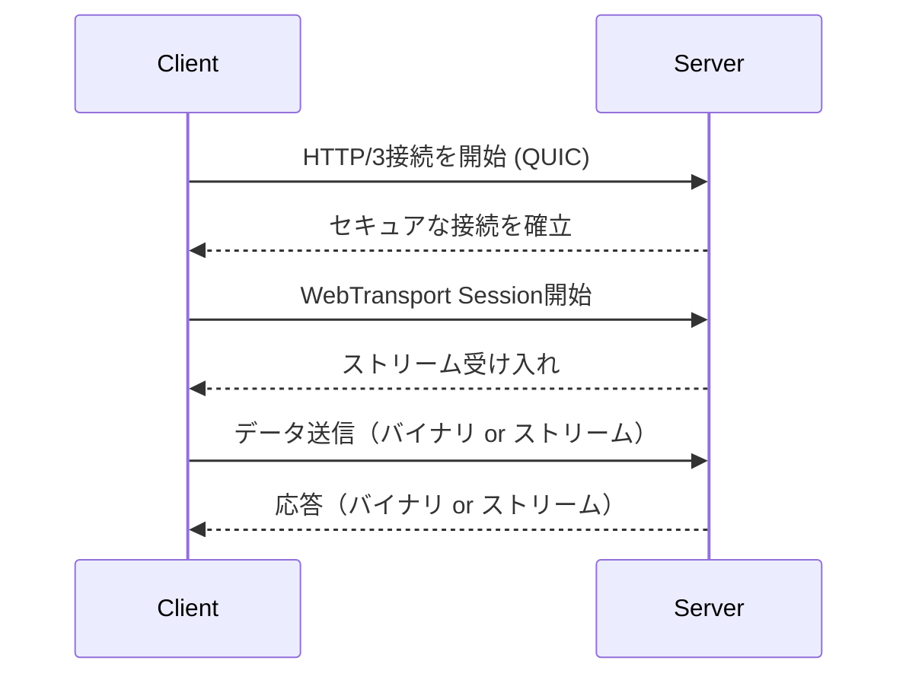

# WebTransport

## WebTransportとは？

WebTransportは、HTTP/3（QUIC）上で動作する次世代の双方向通信プロトコルです。従来のWebSocketやXHR、Fetchでは対応が難しかった高性能・低レイテンシな通信を実現できます。

## 主な特徴

- ✅ **HTTP/3（QUIC）ベース**：UDPを使用し、低遅延・高速な接続を実現
- 🔄 **双方向通信**：クライアント⇄サーバ間でリアルタイムにデータを送受信
- 🔁 **複数ストリーム対応**：1つの接続内で独立した複数のストリームを扱える
- 🔐 **セキュア通信**：TLS 1.3 により暗号化された通信が保証される
- 🔄 **接続再利用が可能（Connection Migration）**：モバイル環境などでのIP変動に強い

## WebSocketとの違い

| 項目 | WebSocket | WebTransport |
|------|-----------|--------------|
| ベースプロトコル | TCP（HTTP/1.1 or 2） | UDP（HTTP/3 + QUIC） |
| 多重化（Multiplexing） | ❌ なし | ✅ 複数ストリーム対応 |
| データ種類 | バイナリ・テキスト | バイナリ・ストリーム・一括データ送信も可 |
| セキュリティ | TLS対応（主にHTTPS） | TLS 1.3 必須 |
| 接続の再開 | ❌ 不可 | ✅ QUICにより可能（再接続不要な場合あり） |
| 利用場面 | チャット、通知などのリアルタイム通信 | 高頻度なデータ転送、メディア処理、ゲーム、IoT |

## 利用例

- ゲームやVR/ARアプリでの低遅延通信
- 動画のインタラクティブ配信
- 大規模データのストリーミング
- IoTデバイスとの安定した通信

## シーケンス図（接続確立例）

## 注意点

- WebTransportはまだ一部ブラウザ（Chromeなど）でのみ利用可能です。
- サーバー側もHTTP/3 + QUICをサポートしている必要があります。
- 従来のWebSocketよりも実装や環境要件は複雑です。

> WebSocketと比べてモダンな構成である反面、導入にはQUICやHTTP/3のインフラ整備が求められる点に注意してください。